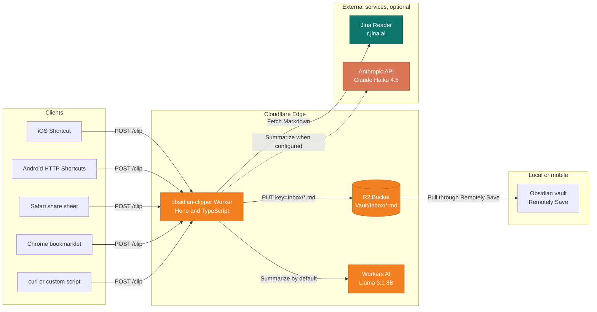
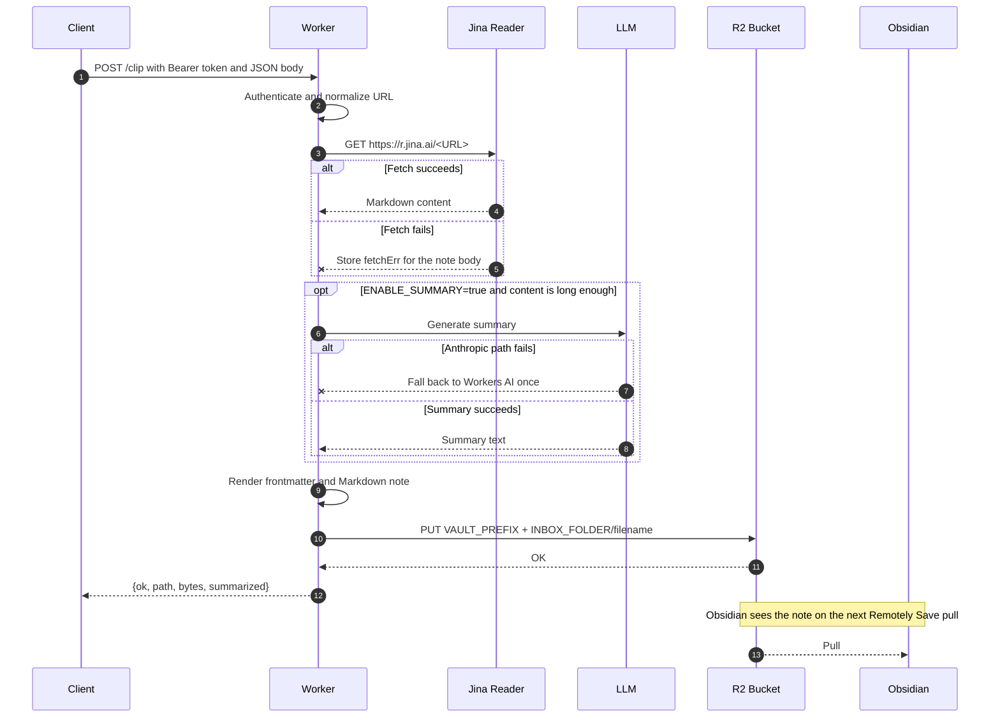

# obsidian-clipper

[](https://developers.cloudflare.com/workers/)
[](https://www.typescriptlang.org/)
[](https://hono.dev/)
[](./LICENSE)

[English](./README.md) | 日本語

Cloudflare R2 上の Obsidian Vault に、Web ページを Markdown ファイルとして保存するセルフホスト型 Cloudflare Worker です。[Remotely Save](https://github.com/remotely-save/remotely-save) で Obsidian と R2 を同期しているユーザーが、自分で読んで変更できる Read It Later パイプラインとして使うことを想定しています。

Worker はショートカット、ブックマークレット、スクリプトなどから URL を受け取り、URL 正規化、Jina Reader による本文 Markdown 取得、Workers AI または Anthropic による任意の要約、R2 へのノート保存を行います。Obsidian 側は Remotely Save の同期でファイルを取得します。

> [!important]
> これはホスティング済みサービスやインストール済みアプリではありません。自分の Cloudflare アカウントにデプロイして使うリファレンス実装です。
>
> 利用には次の前提があります。
>
> - Cloudflare Workers と R2 を扱えること
> - `git`、`bun` または `npm`、`wrangler` などの CLI を使えること
> - Obsidian と Remotely Save で R2 バケットを同期していること
> - iOS ショートカット、Android HTTP Shortcuts、ブックマークレット、自作スクリプトなどのクライアントを自分で設定できること
>
> すぐ使えるリーダーアプリが必要な場合は、Readwise Reader、Instapaper、Raindrop.io などの既製サービスのほうが適しています。このリポジトリは、自分のインフラで動かしたいユーザー向けです。

## 目次

- [特徴](#特徴)
- [技術スタック](#技術スタック)
- [動作概要](#動作概要)
- [リクエストフロー](#リクエストフロー)
- [生成される Markdown](#生成される-markdown)
- [前提条件](#前提条件)
- [セットアップ](#セットアップ)
- [API リファレンス](#api-リファレンス)
- [設定リファレンス](#設定リファレンス)
- [クライアント](#クライアント)
- [運用上のメモ](#運用上のメモ)
- [既知の制約](#既知の制約)
- [ロードマップ](#ロードマップ)
- [コントリビューション](#コントリビューション)
- [ライセンス](#ライセンス)

## 特徴

- iOS ショートカット、Android HTTP Shortcuts、ブラウザのブックマークレット、`curl`、自作スクリプトから `POST /clip` で保存できます。
- `created`、`updated`、`source`、`source_url`、`source_title`、`tags`、`summary` を含む Dataview 向けの frontmatter 付き Markdown を保存します。
- 既定では Workers AI、設定時は Anthropic Claude Haiku 4.5 で要約できます。Anthropic 経路が失敗した場合は Workers AI に 1 回フォールバックします。
- ホスト名 allowlist からタグを付与できます。手動タグがない場合に限り、本文から最大 3 個の LLM タグを生成する設定もあります。
- 本文抽出には Jina Reader を使います。`JINA_API_KEY` を設定すると rate limit が緩和されます。429 または 503 の場合はリトライし、設定済みなら Cloudflare Browser Rendering にフォールバックします。
- `utm_*`、`gclid`、X/Twitter の共有パラメータなどを除去して URL を正規化します。`twitter.com` と `mobile.twitter.com` は `x.com` に揃えます。
- Cloudflare Secrets に保存した共有シークレットで Bearer 認証を行います。
- Remotely Save が使う R2 バケットへ直接書き込みます。通常は `Inbox/` 配下に保存します。
- 個人利用では Cloudflare の無料枠内に収まる想定です。
- Worker 本体は `src/index.ts`、テストは `src/index.test.ts` にあります。

## 技術スタック

| 分類 | 技術 | 用途 |
| --- | --- | --- |
| ランタイム | [Cloudflare Workers](https://developers.cloudflare.com/workers/) | V8 isolate 上のエッジ実行環境 |
| Web フレームワーク | [Hono 4.x](https://hono.dev/) | ルーティング、`bearerAuth`、CORS ミドルウェア |
| 言語 | [TypeScript 5.x](https://www.typescriptlang.org/) | strict モードの実装 |
| パッケージマネージャ | [Bun 1.x](https://bun.sh/) または npm | 依存導入とスクリプト実行 |
| CLI | [Wrangler 4.x](https://developers.cloudflare.com/workers/wrangler/) | ローカル開発、デプロイ、Secrets 管理 |
| オブジェクトストレージ | [Cloudflare R2](https://developers.cloudflare.com/r2/) | Remotely Save と共用する Vault ストレージ |
| 既定の LLM | [Workers AI](https://developers.cloudflare.com/workers-ai/) (`@cf/meta/llama-3.1-8b-instruct`) | 任意の要約生成 |
| 任意の LLM | [Anthropic Claude Haiku 4.5](https://docs.anthropic.com/) | 代替の要約プロバイダ |
| 本文抽出 | [Jina Reader](https://jina.ai/reader/) | URL から Markdown への変換 |
| Vault 同期 | [Remotely Save](https://github.com/remotely-save/remotely-save) | Obsidian と R2 の同期 |

## 動作概要

クライアントが Worker に URL を送ると、Worker が 1 つの Markdown ファイルを R2 に書き込みます。Worker は Obsidian に直接 push しません。Obsidian は Remotely Save の同期時にファイルを取得します。



## リクエストフロー

本文取得や要約が失敗しても、クリップ自体は失敗扱いにしません。Worker は `200 OK` を返し、少なくとも URL とユーザーメモを保存します。本文抽出失敗時はエラー内容を本文セクションに残します。



## 生成される Markdown

保存されるノートは次のスキーマを使います。`source: web-clip` は他のインポート済みノートと一緒に検索・集計できるよう固定しています。

```markdown
---
created: 2026-05-21T12:34:56+09:00
updated: 2026-05-21T12:34:56+09:00
source: web-clip
source_url: "https://example.com/article"
source_title: "記事タイトル"
tags:
  - "clipped"
  - "ios"
summary: "3 から 5 文の要約。"
---

# 記事タイトル

<https://example.com/article>

> [!note] Note
> クライアントから送ったメモ

## Summary
3 から 5 文の要約。

## Selection
> ページ上で選択していたテキスト

## Body
(Jina Reader で抽出した Markdown)
```

ファイル名は `YYYY-MM-DD_HHMMSS_<slugged-title>.md` です。タイムスタンプは JST 固定で、同じ URL を複数回保存しても上書きされません。

## 前提条件

- [Cloudflare アカウント](https://dash.cloudflare.com/sign-up)
- Obsidian Vault 用に Remotely Save で使っている既存の R2 バケット
  - Remotely Save の暗号化は無効にしてください。Worker は R2 に平文 Markdown を直接書き込むため、この構成では暗号化済みオブジェクトを Obsidian 側で読めません。
- [Bun](https://bun.sh/) 1.x または Node.js 18+ と npm
- 任意: [Jina Reader API キー](https://jina.ai/api-dashboard/)。rate limit 緩和用
- 任意: [Anthropic API キー](https://console.anthropic.com/)。Anthropic 要約用

## セットアップ

### 1. リポジトリを clone して依存を入れる

```bash
git clone https://github.com/keroway/obsidian-clipper.git
cd obsidian-clipper
bun install            # または: npm install
```

### 2. Cloudflare にログインする

```bash
bunx wrangler login
```

### 3. `wrangler.jsonc` を編集する

`bucket_name` を Remotely Save と同じ R2 バケット名に変更します。

バケット内で Vault prefix を使っている場合は、`VAULT_PREFIX` に `"MyVault/"` のような値を設定します。末尾スラッシュは必須です。prefix を使っていない場合は `""` のままにします。

バケット名やフォルダは Obsidian の Remotely Save 設定の S3-compatible storage で確認できます。

### 4. 共有シークレットを登録する

```bash
bunx wrangler secret put SHARED_SECRET
```

長いランダム文字列を使います。同じ値をブックマークレット、ショートカット、スクリプト側にも設定します。

```bash
openssl rand -base64 32
```

### 5. 任意: Jina Reader API キーを登録する

キーなしでも動きますが、無認証リクエストは rate limit に当たりやすくなります。

```bash
bunx wrangler secret put JINA_API_KEY
```

### 6. 任意: Anthropic API キーを登録する

Workers AI ではなく Anthropic を要約プロバイダとして使う場合に設定します。

```bash
bunx wrangler secret put ANTHROPIC_API_KEY
```

その後、`wrangler.jsonc` の `vars.SUMMARY_PROVIDER` を `"anthropic"` にしてデプロイします。既定の Anthropic モデルは `claude-haiku-4-5-20251001` です。`vars.ANTHROPIC_MODEL` で変更できます。

Anthropic 経路が 4xx、5xx、または 30 秒タイムアウトで失敗した場合、Worker は Workers AI に 1 回フォールバックします。それでも要約に失敗した場合も、クリップは保存されます。

### 7. 任意: Browser Rendering フォールバックを設定する

Jina Reader が 429 または 503 を返した場合、Worker は指数バックオフでリトライします。それでも失敗した場合、次の 2 つの secret が設定されていれば Cloudflare Browser Rendering の `POST /markdown` エンドポイントを使えます。

```bash
bunx wrangler secret put CF_ACCOUNT_ID
bunx wrangler secret put BROWSER_RENDERING_API_TOKEN
```

どちらかが未設定ならフォールバックは無効です。Browser Rendering は JavaScript 依存のページに有効な場合がありますが、レイテンシ増加と Cloudflare の利用料金に注意してください。取得経路は R2 オブジェクトの `customMetadata.via` に `jina`、`jina-retry`、`browser-rendering` のいずれかで記録されます。

### 8. デプロイする

```bash
bunx wrangler deploy
```

次のような Worker URL を控えておきます。

```text
https://obsidian-clipper.<your-subdomain>.workers.dev
```

### 9. curl で確認する

```bash
curl -X POST https://obsidian-clipper.<your-subdomain>.workers.dev/clip \
  -H "Authorization: Bearer <SHARED_SECRET>" \
  -H "Content-Type: application/json" \
  -d '{"url":"https://blog.cloudflare.com/workers-ai-update/","tags":["test"]}'
```

レスポンス例:

```json
{ "ok": true, "path": "MyVault/Inbox/2026-05-21_123456_Workers-AI-Update.md", "bytes": 5824, "summarized": true }
```

次回の Remotely Save 同期後、`Inbox/` にノートが表示されます。

### 10. クライアントを設定する

- Chrome: [`client/bookmarklet.js`](./client/bookmarklet.js) を編集し、minify してブックマーク URL として保存します。
- iPhone または Mac: [`client/ios-shortcut.md`](./client/ios-shortcut.md) を参照してください。
- Android: [`client/android-shortcut.md`](./client/android-shortcut.md) を参照し、HTTP Shortcuts を設定してください。

## API リファレンス

### `POST /clip`

書き込み用の唯一のエンドポイントです。`GET /` は簡単な使い方テキストを返します。

#### リクエストヘッダ

| ヘッダ | 必須 | 値 |
| --- | --- | --- |
| `Authorization` | はい | `Bearer <SHARED_SECRET>` |
| `Content-Type` | はい | `application/json` |

#### リクエストボディ

| フィールド | 型 | 必須 | 説明 |
| --- | --- | --- | --- |
| `url` | `string` | はい | 保存対象 URL。トラッキングパラメータは自動で除去されます。 |
| `title` | `string` | いいえ | 明示的なタイトル。未指定時は抽出されたタイトルを使います。 |
| `selection` | `string` | いいえ | ページ上で選択していたテキスト。引用ブロックとして保存されます。 |
| `note` | `string` | いいえ | ユーザーメモ。`> [!note]` callout として保存されます。 |
| `tags` | `string[]` | いいえ | 追加タグ。`clipped`、allowlist タグ、任意の LLM タグと統合されます。 |

#### レスポンス

| ステータス | 内容 |
| --- | --- |
| `200` | 成功 JSON または重複 JSON |
| `400` | `{ ok: false, error: 'invalid JSON body' \| 'url is required' \| 'invalid url' }` |
| `401` | `{ ok: false, error: 'Unauthorized' }` |
| `500` | `{ ok: false, error: <unhandled error message> }` |

Jina Reader や要約の失敗はエラーステータスにしません。Worker は失敗内容をノートまたはログに残し、クリップを保存します。

## 設定リファレンス

### `wrangler.jsonc` の変数

| 変数 | 既定値 | 説明 |
| --- | --- | --- |
| `VAULT_PREFIX` | `""` | R2 上の Vault prefix。空文字または `/` 終端である必要があります。 |
| `INBOX_FOLDER` | `"Inbox"` | Vault ルートからの保存先フォルダ。 |
| `ENABLE_SUMMARY` | `"true"` | 要約を有効にします。 |
| `ENABLE_AUTO_TAGS` | `"false"` | 手動タグがない場合に LLM タグを生成します。旧名 `ENABLE_AUTO_TAG` も受け付けます。 |
| `AUTO_TAGS_ALLOWLIST` | `""` | 追加の固定ホスト名タグ。例: `zenn.dev:zenn,github.com:github`。 |
| `SUMMARY_MODEL` | `"@cf/meta/llama-3.1-8b-instruct"` | Workers AI のモデル。 |
| `SUMMARY_PROVIDER` | `"workers-ai"` | `"workers-ai"` または `"anthropic"`。 |
| `ANTHROPIC_MODEL` | `"claude-haiku-4-5-20251001"` | Anthropic のモデル ID。 |

### Secrets

| Secret | 必須 | 説明 |
| --- | --- | --- |
| `SHARED_SECRET` | はい | Bearer 認証用の共有シークレット。 |
| `JINA_API_KEY` | いいえ | Jina Reader の rate limit 緩和用。 |
| `ANTHROPIC_API_KEY` | いいえ | `SUMMARY_PROVIDER=anthropic` のときに必要。 |
| `NOTIFY_WEBHOOK_URL` | いいえ | Discord や Slack 互換エンドポイントへの失敗通知 Webhook URL。 |
| `CF_ACCOUNT_ID` | いいえ | Browser Rendering フォールバック用の Cloudflare account ID。 |
| `BROWSER_RENDERING_API_TOKEN` | いいえ | Browser Rendering フォールバック用 API token。`CF_ACCOUNT_ID` とセットで使います。 |

### バインディング

| バインディング | 種別 | 説明 |
| --- | --- | --- |
| `VAULT` | R2 Bucket | Remotely Save と共用するバケット。 |
| `AI` | Workers AI | 既定の要約プロバイダ。 |

## クライアント

### Chrome ブックマークレット

[`client/bookmarklet.js`](./client/bookmarklet.js) は読みやすい元ファイルです。`WORKER_URL` と `SECRET` を置き換え、bookmarklet minifier などで minify し、ブックマーク URL として保存してください。

実行すると、現在ページの URL、タイトル、選択範囲を Worker に送り、結果を小さな toast で表示します。

### iOS ショートカット

[`client/ios-shortcut.md`](./client/ios-shortcut.md) に、共有シートから URL と任意メモを送るショートカットの作り方を記載しています。macOS Safari の共有シートでも同じ考え方を使えます。

### Android HTTP Shortcuts

[`client/android-shortcut.md`](./client/android-shortcut.md) に [HTTP Shortcuts](https://http-shortcuts.rmy.ch/) の設定手順を記載しています。Android Chrome は共有シートからブックマークレットを直接実行できないため、Android では HTTP Shortcuts を推奨します。

## 運用上のメモ

### Remotely Save の同期タイミング

- macOS と Windows: 手動同期、または Remotely Save の sync-on-change 設定を使います。
- iOS: 通常は Obsidian 起動時に Remotely Save が pull します。

Worker は R2 に書き込むだけです。開いているモバイル版 Obsidian へ即時反映することは、このプロジェクトの範囲外です。

### 重複 URL

Worker は `Inbox/.index/urls.json` に URL index を保持します。同じ正規化済み URL が再度送られた場合は `{ ok: false, duplicate: true, path }` を返します。

意図的に新しいコピーを保存して index を更新したい場合は、`POST /clip` に `?refresh=1` を付けてください。

### コスト

個人利用では通常、無料枠内に収まる想定です。

| サービス | 無料枠または料金メモ | 個人利用の想定 |
| --- | --- | --- |
| Workers | 1 日 100,000 リクエスト | 1 日 数十件程度 |
| R2 | 10 GB-month | 1 ノート数 KB 程度 |
| Workers AI | 1 日 10,000 neurons | 要約 1 回で数 neurons 程度 |
| Jina Reader | キー設定で上限緩和 | 通常は個人利用の範囲内 |
| Anthropic | 有効化時のみ従量課金 | Haiku 4.5 なら低コスト |

### セキュリティ

個人利用を前提に、既定では Bearer token 1 つで認証します。

- 複数人で使う場合は
  [Cloudflare Access](https://developers.cloudflare.com/cloudflare-one/applications/)
  の利用を検討してください。
- `SHARED_SECRET` が漏れた場合は `wrangler secret put SHARED_SECRET` で
  ローテーションし、各クライアントの値も更新してください。
- CORS はブックマークレットから任意ページで呼び出せるよう開いています。
  Bearer token がないリクエストは拒否されます。

#### Secret 漏洩の検知

`SHARED_SECRET`、`JINA_API_KEY`、`ANTHROPIC_API_KEY` などは
Cloudflare Secrets に保存し、リポジトリにコミットしないでください。
ローカル用 `.dev.vars` は gitignore 済みです。

GitHub 側では次の設定を推奨します。

1. Settings、Code security、Secret protection を開く。
2. Secret scanning を有効化する。
3. Push protection を有効化する。
4. 必要に応じて Validity checks も有効化する。

このリポジトリには
[`.github/workflows/gitleaks.yml`](./.github/workflows/gitleaks.yml) の
[`gitleaks`](https://github.com/gitleaks/gitleaks) ワークフローもあります。

#### サプライチェーン保護

新規公開直後の悪意あるパッケージを取り込むリスクを下げるため、
install 時に age gate を使っています。

- Bun: [`bunfig.toml`](./bunfig.toml) の
  `[install].minimumReleaseAge = 604800` 秒。
- npm: [`.npmrc`](./.npmrc) の `minimum-release-age=10080` 分。
  npm 11.5.1 以上が必要です。

その他の運用:

- `bun.lock` をコミットし、CI では `bun install --frozen-lockfile` を使います。
- 依存更新は [Dependabot](./.github/dependabot.yml) 経由で行います。
- より厳密にする場合は GitHub Actions の SHA pinning を検討してください。

## 既知の制約

- Jina Reader は多くの記事で動きますが、paywall コンテンツは抽出できません。
  JavaScript 依存のページには Browser Rendering フォールバックが必要になる
  場合があります。
- Android Chrome は共有シートからブックマークレットを実行できません。
  HTTP Shortcuts を使ってください。
- iOS では、Obsidian と Remotely Save が pull した後にノートが表示されます。
- Remotely Save の暗号化は無効にする必要があります。
- タイムスタンプは JST (`+09:00`) 固定です。他のタイムゾーンにしたい
  場合は `src/index.ts` の `jstStamp` と `jstIso` を変更してください。

## ロードマップ

実装メモと過去の TODO は [`HANDOFF.md`](./HANDOFF.md) と
[`plans/`](./plans/) にあります。URL 重複検知、Anthropic 要約と
Workers AI フォールバック、Browser Rendering フォールバック、自動タグ、
失敗通知、Vitest テストは実装済みです。

残っている低優先度の候補は、Workers Logpush などによる観測性です。

機能追加は `docs/adr/` に ADR を書いてから着手する方針です。

## コントリビューション

Issue と Pull Request を歓迎します。

- バグ報告には再現手順、リクエスト例、秘匿値をマスクした
  `wrangler tail` のログを含めてください。
- 機能提案は [`HANDOFF.md`](./HANDOFF.md) と既存 plan を確認してから
  起票してください。
- コード変更では `bun run typecheck` を通してください。TypeScript strict、
  Wrangler v4、Hono 4.x を維持します。

ローカル開発の例:

```bash
bun run dev
curl -X POST http://127.0.0.1:8787/clip \
  -H "Authorization: Bearer <SHARED_SECRET>" \
  -H "Content-Type: application/json" \
  -d '{"url":"https://example.com/article","tags":["test"]}'
```

ローカル用の secret は `.dev.vars` に書けます。このファイルは gitignore 済みです。

```env
SHARED_SECRET=local-development-secret
JINA_API_KEY=
ANTHROPIC_API_KEY=
```

## ライセンス

[MIT License](./LICENSE) — Copyright (c) 2026 keroway
