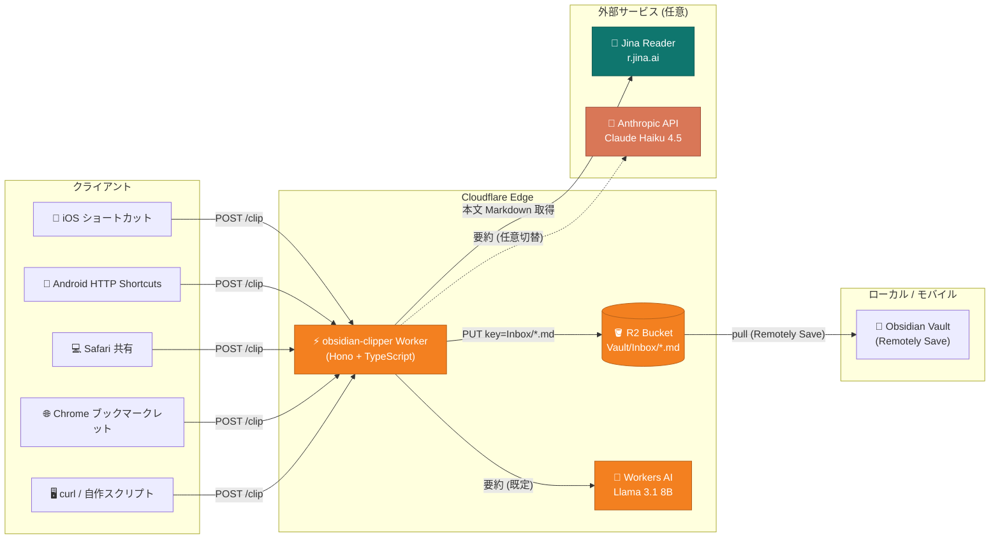
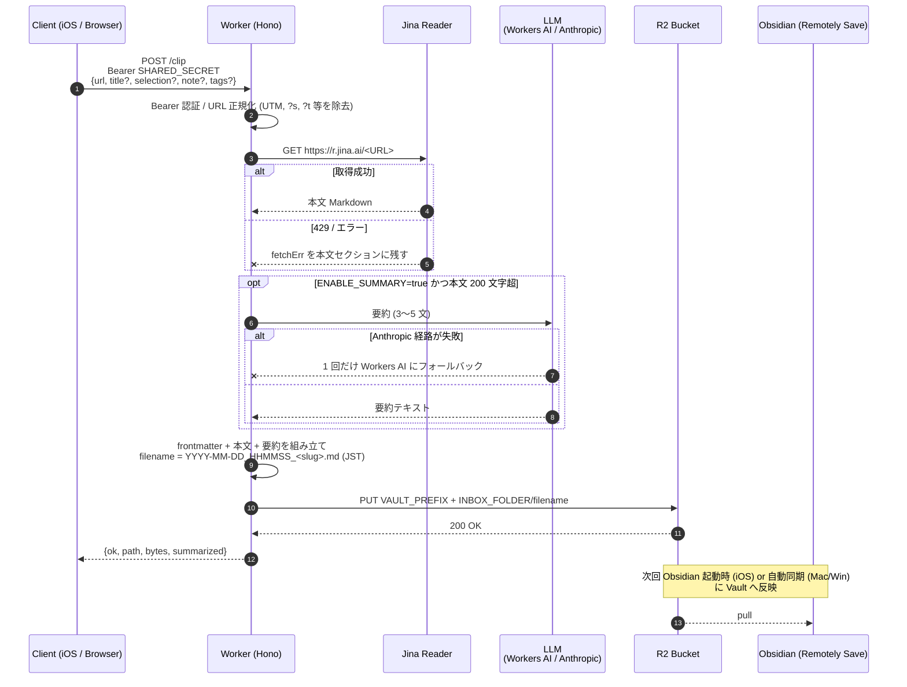

# obsidian-clipper

[](https://developers.cloudflare.com/workers/)
[](https://hono.dev/)
[](https://www.typescriptlang.org/)
[](https://bun.sh/)
[](https://developers.cloudflare.com/workers/wrangler/)
[](https://developers.cloudflare.com/r2/)
[](https://developers.cloudflare.com/workers-ai/)
[](https://docs.anthropic.com/)
[](https://jina.ai/reader/)
[](https://github.com/remotely-save/remotely-save)
[](./LICENSE)

> **iPhone / Mac / ブラウザから 1 タップで送った URL を、本文 + AI 要約付き Markdown として Obsidian Vault (R2) に保存する Cloudflare Worker。**

[Readwise Reader](https://readwise.io/read) や [Instapaper](https://www.instapaper.com/) のような
"Read It Later" を、自分の Obsidian Vault に閉じた形で実現するための最小実装です。
インフラは Cloudflare の無料枠に収まり、ロックインも回避できます。

> [!important]
> **これはアプリでもホスティング済みサービスでもありません。** インストールすればすぐ使える類のものではなく、**自分の Cloudflare アカウント上に自分でデプロイして使う「手引き + 実装例 (リファレンス実装)」** です。
>
> 利用するには最低限、次のことが必要です:
>
> - Cloudflare アカウントと R2 / Workers の有効化
> - ターミナルでの CLI 操作 (`git` / `bun` または `npm` / `wrangler`)
> - Obsidian + [Remotely Save](https://github.com/remotely-save/remotely-save) で R2 バケットを同期している環境
> - クライアント (iOS ショートカット / Android HTTP Shortcuts / ブックマークレット) を自分で設定する手間
>
> 「ストアから入れてログインすれば動くスマホアプリ」を探している場合は、これは合いません。**そのまま [Readwise Reader](https://readwise.io/read) や [Instapaper](https://www.instapaper.com/)、[Raindrop.io](https://raindrop.io/) などの既製サービスを使うほうが早い**です。逆に「自前のインフラに閉じた形で組みたい」「実装を読んで作り変えたい」人向けの土台として書いています。

---

## 目次

- [特徴](#特徴)
- [技術スタック](#技術スタック)
- [動作概要](#動作概要)
- [リクエストフロー](#リクエストフロー)
- [生成される Markdown](#生成される-markdown)
- [前提条件](#前提条件)
- [セットアップ](#セットアップ)
- [API リファレンス](#api-リファレンス)
- [設定リファレンス](#設定リファレンス)
- [クライアント](#クライアント)
- [運用上のメモ](#運用上のメモ)
- [既知の制約](#既知の制約)
- [ロードマップ](#ロードマップ)
- [コントリビューション](#コントリビューション)
- [ライセンス](#ライセンス)

---

## 特徴

- 📥 **1 タップで保存** — iOS ショートカット / Android HTTP Shortcuts / Chrome ブックマークレット / `curl` から `POST /clip` を叩くだけ。
- 📝 **frontmatter 付き Markdown** — `created` / `source_url` / `tags` / `summary` を含む Dataview フレンドリーな形式。
- 🧠 **AI 要約** — Workers AI (Llama 3.1 8B) または Anthropic Claude Haiku 4.5 を選択可能。Anthropic 障害時は自動で Workers AI にフォールバック。
- 🏷️ **タグ自動付与** — ホスト名 allowlist (`zenn.dev`→`zenn` 等) は常時、`ENABLE_AUTO_TAG=true` なら本文から LLM タグも最大 3 個付与。
- 🪶 **本文抽出は Jina Reader** — SPA / 動的サイトでもそれなりに動く。`JINA_API_KEY` を入れれば rate limit が緩む。429/503 時は自動リトライし、なお失敗すれば Browser Rendering にフォールバック (任意設定)。
- 🧹 **URL 正規化** — UTM / `gclid` / X の `?s` `?t` などのトラッキングパラメータを自動除去。`twitter.com` / `mobile.twitter.com` は `x.com` に揃える。
- 🔐 **Bearer 認証** — Cloudflare Secrets で共有シークレットを管理。複数人で使うなら Cloudflare Access に切替可能。
- 📦 **Remotely Save と相乗り** — 既存の R2 バケットの `Inbox/` に直接書き込み、Obsidian 側は普段の同期で取り込む。
- 💰 **無料枠で運用可能** — Worker / R2 / Workers AI いずれも個人利用では無料枠内で完結。
- 🪶 **シングルファイル実装** — Worker 本体は `src/index.ts` の ~400 行のみ。読みきれるサイズ。

## 技術スタック

| カテゴリ              | 技術                                                                                       | 用途                                          |
| --------------------- | ------------------------------------------------------------------------------------------ | --------------------------------------------- |
| ランタイム            | [Cloudflare Workers](https://developers.cloudflare.com/workers/)                           | エッジ実行環境 (V8 isolate)                   |
| Web フレームワーク    | [Hono 4.x](https://hono.dev/)                                                              | ルーティング / `bearerAuth` / `cors` ミドル   |
| 言語                  | [TypeScript 5.x](https://www.typescriptlang.org/) (strict)                                 | 型安全な実装                                  |
| パッケージマネージャ  | [Bun 1.x](https://bun.sh/) (npm でも可)                                                    | 依存導入 / スクリプト実行                     |
| CLI                   | [Wrangler 4.x](https://developers.cloudflare.com/workers/wrangler/)                        | ローカル開発 / デプロイ / Secrets 管理        |
| オブジェクトストレージ| [Cloudflare R2](https://developers.cloudflare.com/r2/)                                     | Vault バケット (Remotely Save と共用)         |
| LLM (要約・既定)      | [Workers AI](https://developers.cloudflare.com/workers-ai/) (`@cf/meta/llama-3.1-8b-instruct`) | 日本語要約 (3〜5 文)                          |
| LLM (要約・任意)      | [Anthropic Claude Haiku 4.5](https://docs.anthropic.com/)                                  | 高品質な日本語要約への切替先                  |
| 本文抽出              | [Jina Reader](https://jina.ai/reader/)                                                     | URL → Markdown 変換                           |
| Vault 同期            | [Remotely Save](https://github.com/remotely-save/remotely-save)                            | Obsidian ↔ R2 の双方向同期                   |

---

## 動作概要

クライアントが送った URL は Cloudflare の Worker でパイプライン処理され、最終的に Markdown ファイルとして R2 に格納されます。Obsidian は Remotely Save 経由で R2 を pull するため、Vault に新しいノートが現れる形になります。



## リクエストフロー

1 リクエストの中で起きていることを時系列で表すと次のようになります。本文取得 / 要約はどちらも失敗しても 200 を返し、最低限 URL とユーザメモは保存される設計です (詳細は [`src/index.ts`](./src/index.ts))。



---

## 生成される Markdown

Vault に書き出されるノートは以下の形式です。`source: web-clip` を含む frontmatter は Keep など他の移行スクリプトと共通スキーマで、Dataview から横断クエリできます。

```markdown
---
created: 2026-05-21T12:34:56+09:00
updated: 2026-05-21T12:34:56+09:00
source: web-clip
source_url: "https://example.com/article"
source_title: "記事タイトル"
tags:
  - "clipped"
  - "ios"
summary: "結論を最初の 1 文に置いた 3〜5 文の日本語要約。"
---

# 記事タイトル

<https://example.com/article>

> [!note] メモ
> ユーザが共有時に追記したメモ

## 要約
結論を最初の 1 文に置いた 3〜5 文の日本語要約。

## 抜粋
> ページ上で選択していたテキストがあればここに入る

## 本文
(Jina Reader で抽出した記事本文 Markdown)
```

ファイル名は `YYYY-MM-DD_HHMMSS_<slugged-title>.md` (JST 固定)。タイムスタンプ付きなので同じ記事を複数回保存しても上書きされません。

---

## 前提条件

- [Cloudflare アカウント](https://dash.cloudflare.com/sign-up) (無料プランで OK)
- 既存の **R2 バケット**: [Remotely Save](https://github.com/remotely-save/remotely-save) で Vault を同期しているバケットをそのまま流用する想定
  - Remotely Save の **暗号化は OFF** にしておくこと (Worker が直接書き込んだ Markdown を Obsidian で読めなくなるため)
- [Bun](https://bun.sh/) 1.x または Node.js 18+ (`npm` でも代替可)
- (任意) [Jina Reader API キー](https://jina.ai/api-dashboard/) — rate limit 緩和
- (任意) [Anthropic API キー](https://console.anthropic.com/) — 要約品質を上げたい場合

---

## セットアップ

### 1. クローン & 依存インストール

```bash
git clone https://github.com/keroway/obsidian-clipper.git
cd obsidian-clipper
bun install            # もしくは: npm install
```

### 2. Cloudflare にログイン

```bash
bunx wrangler login
```

### 3. `wrangler.jsonc` を編集

`bucket_name` を Remotely Save と同じ R2 バケット名に書き換え。
prefix を使っているなら `VAULT_PREFIX` に `"MyVault/"` のように設定 (**末尾スラッシュ必須**)。使っていなければ `""` のまま。

> 確認方法: Obsidian の Remotely Save 設定 → "S3 (-compatible)" → Bucket Name / Folder。

### 4. 共有シークレットを登録

```bash
bunx wrangler secret put SHARED_SECRET
```

長めのランダム文字列を 1 回だけ貼り付ける。あとでブックマークレットと iOS ショートカットの両方で同じ値を使います。

```bash
# 例: 32 バイトのランダム文字列を生成
openssl rand -base64 32
```

### 5. (任意) Jina Reader API キーを登録

無料・無認証でも動作しますが、初回から 429 (rate limit) を引きやすいので登録推奨。
<https://jina.ai/api-dashboard/> でアカウントを作って API キーを取得し、Cloudflare 側にも secret として登録します。

```bash
bunx wrangler secret put JINA_API_KEY
```

未設定の場合は無認証のフォールバックで動きます。

### 6. (任意) Anthropic API キーを登録 — 要約品質を上げたい場合

Workers AI (`@cf/meta/llama-3.1-8b-instruct`) の日本語要約品質に不満がある場合、Anthropic Claude にプロバイダを切り替えられます。

```bash
bunx wrangler secret put ANTHROPIC_API_KEY
```

切替は `wrangler.jsonc` の `vars.SUMMARY_PROVIDER` を `"anthropic"` に変更してデプロイ。既定モデルは Claude Haiku 4.5 (`claude-haiku-4-5-20251001`)。`vars.ANTHROPIC_MODEL` で別モデルにも差し替え可能です。

Anthropic ルートが 4xx / 5xx / タイムアウト (30 秒) のいずれかで失敗した場合、自動的に Workers AI へ 1 回だけフォールバックします。要約自体が完全に失敗してもクリップは成功扱いで本文は保存されます。

### 7. (任意) Browser Rendering フォールバックを登録 — 本文取得の成功率を上げたい場合

Jina Reader が 429 / 503 を返すと、まず指数バックオフで最大 2 回リトライします。それでも失敗した場合、[Cloudflare Browser Rendering](https://developers.cloudflare.com/browser-rendering/) の `POST /markdown` エンドポイントにフォールバックして本文 Markdown を取得します（SPA / JS 後挿入の本文にも強い）。

有効化するには、アカウント ID と Browser Rendering 実行権限のある API トークンの **両方** を登録します。

```bash
bunx wrangler secret put CF_ACCOUNT_ID
bunx wrangler secret put BROWSER_RENDERING_API_TOKEN
```

どちらかが未設定ならフォールバックは無効化され、従来どおり Jina のみで動作します（失敗時は本文セクションにエラー理由を残して 200）。フォールバック利用時は Browser Rendering の課金とレイテンシ増（最悪ケースで Jina リトライ + Browser Rendering の往復）が発生する点に注意してください。どの経路で取得できたかは R2 オブジェクトの `customMetadata.via`（`jina` / `jina-retry` / `browser-rendering`）で確認できます。

### 8. デプロイ

```bash
bunx wrangler deploy
```

出力に `https://obsidian-clipper.<your-subdomain>.workers.dev` が出るので控えておきます。

### 9. 動作確認 (curl)

```bash
curl -X POST https://obsidian-clipper.<your-subdomain>.workers.dev/clip \
  -H "Authorization: Bearer <SHARED_SECRET>" \
  -H "Content-Type: application/json" \
  -d '{"url":"https://blog.cloudflare.com/workers-ai-update/","tags":["test"]}'
```

レスポンス例:

```json
{ "ok": true, "path": "MyVault/Inbox/2026-05-21_123456_Workers-AI-Update.md", "bytes": 5824, "summarized": true }
```

次回 Obsidian の Remotely Save sync で `Inbox/` に新しいノートが現れたら成功です。

### 10. クライアント設定

- **Chrome**: [`client/bookmarklet.js`](./client/bookmarklet.js) を minify してブックマークの URL に登録
- **iPhone / Mac**: [`client/ios-shortcut.md`](./client/ios-shortcut.md) の手順でショートカット作成
- **Android**: [`client/android-shortcut.md`](./client/android-shortcut.md) の手順で HTTP Shortcuts を設定

---

## API リファレンス

### `POST /clip`

唯一のエンドポイント。Worker は他の経路は提供しません (`GET /` は使い方の説明テキストを返すだけ)。

#### リクエストヘッダ

| ヘッダ          | 必須 | 値                                |
| --------------- | ---- | --------------------------------- |
| `Authorization` | ✅   | `Bearer <SHARED_SECRET>`          |
| `Content-Type`  | ✅   | `application/json`                |

#### リクエストボディ

| フィールド   | 型         | 必須 | 説明                                                              |
| ------------ | ---------- | ---- | ----------------------------------------------------------------- |
| `url`        | `string`   | ✅   | 保存対象 URL。トラッキングパラメータは自動除去                    |
| `title`      | `string`   | -    | 明示指定するタイトル。未指定なら Jina Reader が抽出したものを使用 |
| `selection`  | `string`   | -    | ページ上で選択していたテキスト (引用ブロックとして保存)           |
| `note`       | `string`   | -    | ユーザのメモ (`> [!note]` callout として保存)                     |
| `tags`       | `string[]` | -    | 追加タグ。`clipped` + allowlist/LLM タグと統合される             |

#### レスポンス

| ステータス | 内容                                                        |
| ---------- | ----------------------------------------------------------- |
| `200`      | `{ ok: true, path, bytes, summarized }`                     |
| `400`      | `{ ok: false, error: 'invalid JSON body' \| 'url is required' \| 'invalid url' }` |
| `401`      | `{ ok: false, error: 'Unauthorized' }` (Bearer 不一致)      |
| `500`      | `{ ok: false, error: <unhandled error message> }`           |

> **失敗ポリシー**: Jina Reader / 要約のどちらが失敗しても 200 を返します。Jina が 429/503 のときは指数バックオフで最大 2 回リトライし、なお失敗かつ Browser Rendering が設定済みならそちらにフォールバックします。それでも本文が取れなかった場合は本文セクションにエラー理由が残るだけで、URL とユーザメモは保存されます。

---

## 設定リファレンス

### 環境変数 (`wrangler.jsonc` の `vars`)

| 変数                  | 既定値                          | 説明                                                                 |
| --------------------- | ------------------------------- | -------------------------------------------------------------------- |
| `VAULT_PREFIX`        | `""`                            | Vault が R2 上で持つ prefix。**末尾スラッシュ必須**または空文字       |
| `INBOX_FOLDER`        | `"Inbox"`                       | Vault ルートからの保存先サブフォルダ                                 |
| `ENABLE_SUMMARY`      | `"true"`                        | 要約を有効化するか                                                   |
| `ENABLE_AUTO_TAG`     | `"false"`                       | 本文+ホスト名から LLM タグを生成 (allowlist タグは常に付与)          |
| `SUMMARY_MODEL`       | `"@cf/meta/llama-3.1-8b-instruct"` | Workers AI で使うモデル                                              |
| `SUMMARY_PROVIDER`    | `"workers-ai"`                  | `"workers-ai"` または `"anthropic"`                                  |
| `ANTHROPIC_MODEL`     | `"claude-haiku-4-5-20251001"`   | Anthropic を使う場合のモデル ID                                      |

### シークレット (`wrangler secret put`)

| シークレット        | 必須 | 説明                                                              |
| ------------------- | ---- | ----------------------------------------------------------------- |
| `SHARED_SECRET`     | ✅   | Bearer 認証用の共有シークレット                                   |
| `JINA_API_KEY`      | -    | Jina Reader の rate limit を緩和                                  |
| `ANTHROPIC_API_KEY` | -    | `SUMMARY_PROVIDER=anthropic` のときに使用                         |
| `NOTIFY_WEBHOOK_URL` | -   | 失敗通知先 Webhook URL (Discord/Slack 互換)                      |
| `CF_ACCOUNT_ID`     | -    | Browser Rendering フォールバック用のアカウント ID                |
| `BROWSER_RENDERING_API_TOKEN` | - | Browser Rendering 実行権限のある API トークン (上記とセットで有効) |

### バインディング

| バインディング | 種別      | 説明                                          |
| -------------- | --------- | --------------------------------------------- |
| `VAULT`        | R2 Bucket | Remotely Save と共用する Vault バケット       |
| `AI`           | Workers AI | 既定の要約プロバイダ                          |

---

## クライアント

### Chrome ブックマークレット

[`client/bookmarklet.js`](./client/bookmarklet.js) は読みやすい非 minify 版です。`WORKER_URL` と `SECRET` を自分の値に書き換え、[bookmarklet minifier](https://chriszarate.github.io/bookmarklet/) などで minify してブックマークの URL に登録してください。

実行すると現在ページの URL / タイトル / 選択範囲を Worker に POST し、右下にトーストで結果を表示します。

### iOS ショートカット

[`client/ios-shortcut.md`](./client/ios-shortcut.md) に手順を記載しています。共有シートから 1 タップで URL とメモを Worker に送れます (Apple Watch / Mac Safari 共有シートにも展開可能)。

### Android (HTTP Shortcuts)

[`client/android-shortcut.md`](./client/android-shortcut.md) に手順を記載しています。Android の Chrome はブックマークレットを共有シートから起動できないため、無料・OSS の [HTTP Shortcuts](https://http-shortcuts.rmy.ch/) を使い、共有シートから 1 タップで `POST /clip` を叩きます (Android 11+ は Direct Share にも対応)。

---

## 運用上のメモ

### Remotely Save の同期タイミング

- **Mac / Windows**: 起動中であれば手動同期 or "Sync on file change" を有効化
- **iOS**: Obsidian 起動時にのみ pull が走るのが基本

→ クリップ即時反映は仕様外。「次に Obsidian を開いたら来ている」体験で割り切ること。

### 重複 URL

意図的に重複検知を入れていません (タイムスタンプでファイル名が割れるので衝突はしない)。同じ記事を 2 回保存してしまうことが多い場合は [`HANDOFF.md`](./HANDOFF.md) の TODO を参照してください。

### コスト

個人利用前提なら **すべて無料枠に収まる** 想定です:

| サービス     | 無料枠                                | 想定使用量                |
| ------------ | ------------------------------------- | ------------------------- |
| Workers      | 1 日 10 万リクエスト                  | 1 日 数十リクエスト       |
| R2           | 10 GB / 月、Class A 100 万 / 月       | Markdown は 1 件 数 KB    |
| Workers AI   | 1 日 10,000 neurons                   | 要約 1 回 ~数 neurons     |
| Jina Reader  | 無料・無認証 (key で rate limit 緩和) | 個人用途では到達しない    |
| Anthropic    | 従量課金 (使う場合のみ)               | Haiku 4.5 は非常に安価    |

### セキュリティ

個人利用前提のため Bearer 1 本でシンプルにしてあります。

- 複数人で共有する場合は [Cloudflare Access](https://developers.cloudflare.com/cloudflare-one/applications/) (Zero Trust, 個人プラン無料) に切り替えて IdP 経由の認証に
- `SHARED_SECRET` を漏らした場合は `wrangler secret put SHARED_SECRET` で上書きすれば即時無効化されます (新シークレットを各クライアントに再配布)
- CORS は `*` で開いています (ブックマークレットから叩く前提)。Bearer がないと弾かれるので実害はありませんが、気になる場合は `src/index.ts` の `cors({ origin: ... })` を絞ってください

#### Secret 漏洩の検知

Worker 用の secret (`SHARED_SECRET` / `JINA_API_KEY` / `ANTHROPIC_API_KEY`) は **Cloudflare Secrets** で管理し、リポジトリには絶対にコミットしない方針です。ローカル開発用の `.dev.vars` も `.gitignore` 済みです。

その上で、誤コミットを多層で防ぐためにリポジトリ側で以下を有効化することを推奨します。GitHub UI 側の操作 (リポジトリオーナーのみ可能) は以下:

1. **Settings → Code security → Secret protection** を開く
2. **Secret scanning** を Enable
3. **Push protection** を Enable (これで生 token を含む push 自体が GitHub 側でブロックされる)
4. (任意) **Validity checks** を Enable: 検知された token が live かどうかも自動チェック

CI 側では [`gitleaks`](https://github.com/gitleaks/gitleaks) を [`.github/workflows/gitleaks.yml`](./.github/workflows/gitleaks.yml) で push / PR / 週次に走らせています。GitHub 標準の Secret Scanning が拾わないパターン (独自 token など) もここで検知できます。

#### サプライチェーン保護 (汚染パッケージ対策)

npm パッケージは公開直後にマルウェアが紛れ込むことがあり、検知されるまで数時間〜数日かかります。これに備えて install 段階で **公開から 7 日経過していない version をブロック** する age gate を効かせています。

- **Bun**: [`bunfig.toml`](./bunfig.toml) の `[install].minimumReleaseAge = 604800` (秒)
- **npm**: [`.npmrc`](./.npmrc) の `minimum-release-age=10080` (分。npm 11.5.1+ が必要)

緊急の zero-day patch を取り込みたい場合は、それぞれ `minimumReleaseAgeExcludes` / `minimum-release-age-exclude` にパッケージ名を追加します。

その他のサプライチェーン関連の運用:

- **lockfile (`bun.lock`) は必ずコミット**。`bun install --frozen-lockfile` を CI で走らせるので、勝手にバージョンが上がる経路は無い
- **依存更新は [Dependabot](./.github/dependabot.yml) 経由のみ**。週次で `npm` / `github-actions` の 2 系統に PR が来るので、CI (`typecheck`) と Diff を見てマージする
- **GitHub Actions は SHA ピン留め推奨**。Dependabot は SHA も更新してくれるので、本格化する場合は `gitleaks-action@v2` を SHA に切り替え

---

## 既知の制約

- **本文抽出の限界**: Jina Reader は媒体記事には強いものの、paywall コンテンツは取れません。SPA / JS 後挿入の本文は [Cloudflare Browser Rendering API](https://developers.cloudflare.com/browser-rendering/) フォールバック (任意設定) でカバーできます。
- **Android Chrome のブックマークレット非対応**: アドレスバー経由でしか起動できず共有シートから使えないため、Android では [HTTP Shortcuts](./client/android-shortcut.md) を使います。
- **iOS の即時性**: Obsidian 起動時にしか Remotely Save の pull が走らないため、保存と Vault 反映には時差があります。
- **Remotely Save の暗号化**: ON にすると Worker 直書きのファイルが Obsidian 側で読めなくなります。OFF 必須。
- **JST 固定**: タイムスタンプは JST (`+09:00`) でハードコードしています。他タイムゾーンで使う場合は `src/index.ts` の `jstStamp` / `jstIso` を編集してください。
- **テスト未導入**: vitest + `@cloudflare/vitest-pool-workers` での導入は [`HANDOFF.md`](./HANDOFF.md) の TODO 参照。

---

## ロードマップ

未実装の TODO とそれぞれの設計指針は [`HANDOFF.md`](./HANDOFF.md) にまとめています。主な候補:

- URL 重複検知 (`Inbox/.index/urls.json` ベース)
- ~~Jina Reader 障害時の Browser Rendering フォールバック~~ (実装済み)
- ~~本文 + ホスト名からのタグ自動付与 (LLM タグ含む)~~ (実装済み)
- Slack / Discord への失敗通知 webhook
- vitest によるユニット / 統合テスト
- Workers Logpush による観測性

機能追加の際は `docs/adr/` に ADR を書いてから着手する方針です (現状ディレクトリ未作成)。

---

## コントリビューション

Issue / PR は歓迎します。

- バグ報告: 再現手順 (リクエスト例 / `wrangler tail` 抜粋) を含めてください
- 機能提案: まず [`HANDOFF.md`](./HANDOFF.md) を参照し、既出 TODO ならその上に積む形で議論しましょう
- コードを書く場合: `bun run typecheck` を通すこと。TypeScript strict と Wrangler v4 / Hono ^4 を維持

開発の最短ループは:

```bash
bun run dev
curl -X POST http://127.0.0.1:8787/clip \
  -H "Authorization: Bearer <SHARED_SECRET>" \
  -H "Content-Type: application/json" \
  -d '{"url":"https://example.com/article","tags":["test"]}'
```

ローカル開発時の `SHARED_SECRET` などは `.dev.vars` に書いておくと `wrangler dev` が読み込みます (このファイルは `.gitignore` 済み)。

```env
# .dev.vars
SHARED_SECRET=local-development-secret
JINA_API_KEY=
ANTHROPIC_API_KEY=
```

---

## ライセンス

[MIT License](./LICENSE) — Copyright (c) 2026 keroway
