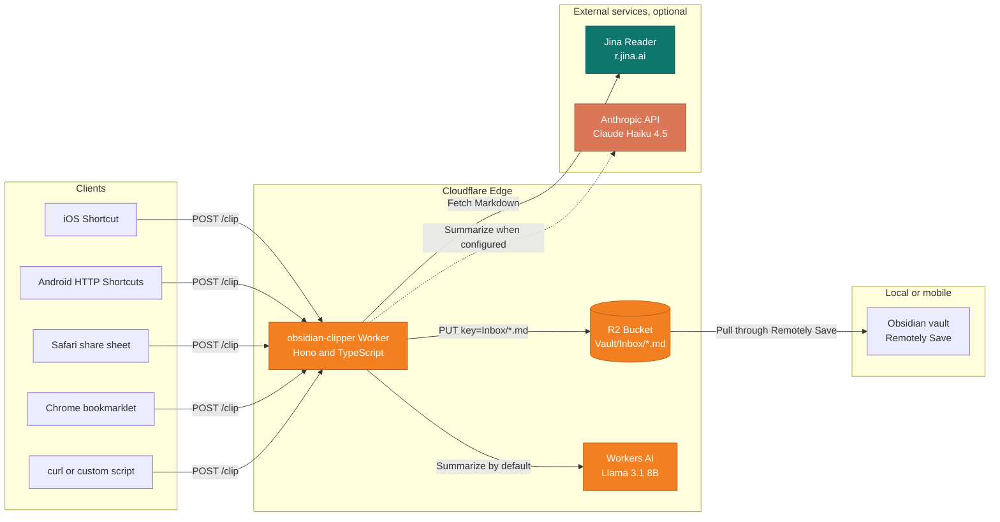
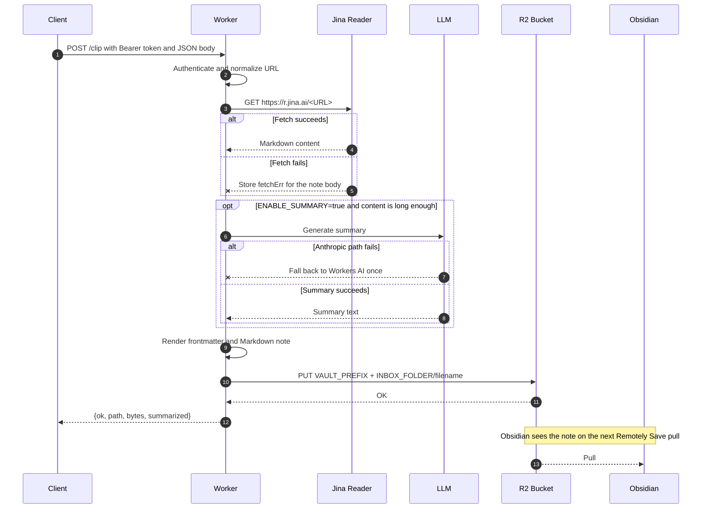

# obsidian-clipper

[](https://developers.cloudflare.com/workers/)
[](https://www.typescriptlang.org/)
[](https://hono.dev/)
[](./LICENSE)

English | [日本語](./README.ja.md)

A self-hosted Cloudflare Worker that saves web pages as Markdown files in an Obsidian vault stored on Cloudflare R2. It is designed for people who already use Obsidian with [Remotely Save](https://github.com/remotely-save/remotely-save) and want a small Read It Later pipeline they can inspect, deploy, and modify.

The Worker accepts a URL from a shortcut, bookmarklet, or script; normalizes the URL; fetches readable Markdown through Jina Reader; optionally summarizes the content with Workers AI or Anthropic; and writes the resulting note to R2. Obsidian later pulls the file through Remotely Save.

> [!important]
> This is not a hosted service or an installable app. It is a reference implementation that you deploy to your own Cloudflare account.
>
> You should be comfortable with:
>
> - Cloudflare Workers and R2
> - command-line tools such as `git`, `bun` or `npm`, and `wrangler`
> - Obsidian with Remotely Save configured against an R2 bucket
> - setting up your own client entry point, such as an iOS Shortcut, Android HTTP Shortcuts, a bookmarklet, or a custom script
>
> If you want a ready-made reader app, use Readwise Reader, Instapaper, Raindrop.io, or a similar service. This repository is for users who prefer to run the pipeline themselves.

## Table of contents

- [Features](#features)
- [Technology stack](#technology-stack)
- [How it works](#how-it-works)
- [Request flow](#request-flow)
- [Generated Markdown](#generated-markdown)
- [Requirements](#requirements)
- [Setup](#setup)
- [API reference](#api-reference)
- [Configuration reference](#configuration-reference)
- [Clients](#clients)
- [Operational notes](#operational-notes)
- [Known limitations](#known-limitations)
- [Roadmap](#roadmap)
- [Contributing](#contributing)
- [License](#license)

## Features

- Save pages through `POST /clip` from iOS Shortcuts, Android HTTP Shortcuts, a browser bookmarklet, `curl`, or your own script.
- Store notes as Markdown with Dataview-friendly frontmatter: `created`, `updated`, `source`, `source_url`, `source_title`, `tags`, and `summary`.
- Generate optional summaries with Workers AI by default, or Anthropic Claude Haiku 4.5 when configured. If Anthropic fails, the Worker falls back to Workers AI once.
- Add tags from a hostname allowlist, and optionally generate up to three LLM-based tags when no manual tags are provided.
- Extract article content through Jina Reader. With `JINA_API_KEY`, rate limits are relaxed. On 429 or 503 responses, the Worker retries and can fall back to Cloudflare Browser Rendering when configured.
- Normalize URLs by removing common tracking parameters such as `utm_*`, `gclid`, and X/Twitter share parameters. `twitter.com` and `mobile.twitter.com` are normalized to `x.com`.
- Use Bearer authentication with a shared secret stored as a Cloudflare secret.
- Write directly to the R2 bucket used by Remotely Save, usually under `Inbox/`.
- Stay within Cloudflare free tiers for typical personal use.
- Keep the Worker implementation in `src/index.ts`, with tests in `src/index.test.ts`.

## Technology stack

| Area | Technology | Purpose |
| --- | --- | --- |
| Runtime | [Cloudflare Workers](https://developers.cloudflare.com/workers/) | Edge runtime using V8 isolates |
| Web framework | [Hono 4.x](https://hono.dev/) | Routing, `bearerAuth`, and CORS middleware |
| Language | [TypeScript 5.x](https://www.typescriptlang.org/) | Strictly typed implementation |
| Package manager | [Bun 1.x](https://bun.sh/) or npm | Dependency installation and scripts |
| CLI | [Wrangler 4.x](https://developers.cloudflare.com/workers/wrangler/) | Local development, deployment, and secret management |
| Object storage | [Cloudflare R2](https://developers.cloudflare.com/r2/) | Obsidian vault storage shared with Remotely Save |
| Default LLM | [Workers AI](https://developers.cloudflare.com/workers-ai/) (`@cf/meta/llama-3.1-8b-instruct`) | Optional summaries |
| Optional LLM | [Anthropic Claude Haiku 4.5](https://docs.anthropic.com/) | Alternative summary provider |
| Content extraction | [Jina Reader](https://jina.ai/reader/) | URL to Markdown conversion |
| Vault sync | [Remotely Save](https://github.com/remotely-save/remotely-save) | Obsidian to R2 synchronization |

## How it works

A client sends a URL to the Worker. The Worker processes it and writes one Markdown file to R2. Obsidian does not receive a direct push from the Worker; it discovers the file when Remotely Save syncs the vault.



## Request flow

Article fetching and summarization failures do not make the clip fail. The Worker still returns `200 OK` and saves the URL and user note, with the fetch error recorded in the body section when content extraction fails.



## Generated Markdown

The Worker writes notes with the following schema. `source: web-clip` is intentionally stable so the notes can be queried together with other imported content.

```markdown
---
created: 2026-05-21T12:34:56+09:00
updated: 2026-05-21T12:34:56+09:00
source: web-clip
source_url: "https://example.com/article"
source_title: "Article title"
tags:
  - "clipped"
  - "ios"
summary: "A three to five sentence summary."
---

# Article title

<https://example.com/article>

> [!note] Note
> User note supplied by the client

## Summary
A three to five sentence summary.

## Selection
> Text selected on the page, if provided

## Body
(Markdown extracted by Jina Reader)
```

Filenames use `YYYY-MM-DD_HHMMSS_<slugged-title>.md` with a fixed JST timestamp. The timestamp prevents overwriting when the same URL is clipped more than once.

## Requirements

- A [Cloudflare account](https://dash.cloudflare.com/sign-up)
- An existing R2 bucket used by Remotely Save for your Obsidian vault
  - Remotely Save encryption must be disabled. The Worker writes plain Markdown directly to R2, so encrypted Remotely Save objects cannot be read by Obsidian in this setup.
- [Bun](https://bun.sh/) 1.x or Node.js 18+ with npm
- Optional: a [Jina Reader API key](https://jina.ai/api-dashboard/) for higher rate limits
- Optional: an [Anthropic API key](https://console.anthropic.com/) for Anthropic summaries

## Setup

### 1. Clone the repository and install dependencies

```bash
git clone https://github.com/keroway/obsidian-clipper.git
cd obsidian-clipper
bun install            # or: npm install
```

### 2. Log in to Cloudflare

```bash
bunx wrangler login
```

### 3. Edit `wrangler.jsonc`

Set `bucket_name` to the same R2 bucket used by Remotely Save.

If your vault uses a prefix in the bucket, set `VAULT_PREFIX` to a value such as `"MyVault/"`. The trailing slash is required. If no prefix is used, leave it as `""`.

You can confirm the bucket and folder in Obsidian under Remotely Save settings for S3-compatible storage.

### 4. Register the shared secret

```bash
bunx wrangler secret put SHARED_SECRET
```

Use a long random string. The same value must be configured in your bookmarklet, shortcut, or script.

```bash
openssl rand -base64 32
```

### 5. Optional: register a Jina Reader API key

The Worker works without a key, but unauthenticated Jina Reader requests are more likely to hit rate limits.

```bash
bunx wrangler secret put JINA_API_KEY
```

### 6. Optional: register an Anthropic API key

Use this when you want Anthropic as the summary provider instead of Workers AI.

```bash
bunx wrangler secret put ANTHROPIC_API_KEY
```

Then set `vars.SUMMARY_PROVIDER` in `wrangler.jsonc` to `"anthropic"` and deploy. The default Anthropic model is `claude-haiku-4-5-20251001`. You can override it with `vars.ANTHROPIC_MODEL`.

If the Anthropic route returns 4xx, 5xx, or times out after 30 seconds, the Worker falls back to Workers AI once. If summarization still fails, the clip is still saved.

### 7. Optional: configure Browser Rendering fallback

When Jina Reader returns 429 or 503, the Worker retries with exponential backoff. If retries still fail, it can use Cloudflare Browser Rendering's `POST /markdown` endpoint when both of these secrets are set:

```bash
bunx wrangler secret put CF_ACCOUNT_ID
bunx wrangler secret put BROWSER_RENDERING_API_TOKEN
```

If either secret is missing, the fallback is disabled. Browser Rendering can improve extraction for JavaScript-heavy pages, but it adds latency and may incur Cloudflare usage costs. The selected fetch path is recorded in R2 object `customMetadata.via` as `jina`, `jina-retry`, or `browser-rendering`.

### 8. Deploy

```bash
bunx wrangler deploy
```

Save the resulting Worker URL, for example:

```text
https://obsidian-clipper.<your-subdomain>.workers.dev
```

### 9. Test with curl

```bash
curl -X POST https://obsidian-clipper.<your-subdomain>.workers.dev/clip \
  -H "Authorization: Bearer <SHARED_SECRET>" \
  -H "Content-Type: application/json" \
  -d '{"url":"https://blog.cloudflare.com/workers-ai-update/","tags":["test"]}'
```

Example response:

```json
{ "ok": true, "path": "MyVault/Inbox/2026-05-21_123456_Workers-AI-Update.md", "bytes": 5824, "summarized": true }
```

After the next Remotely Save sync, the note should appear in `Inbox/`.

### 10. Configure a client

- Chrome: edit [`client/bookmarklet.js`](./client/bookmarklet.js), minify it, and save it as a bookmark URL.
- iPhone or Mac: follow [`client/ios-shortcut.md`](./client/ios-shortcut.md).
- Android: follow [`client/android-shortcut.md`](./client/android-shortcut.md) for HTTP Shortcuts.

## API reference

### `POST /clip`

This is the only write endpoint. `GET /` returns short usage text.

#### Request headers

| Header | Required | Value |
| --- | --- | --- |
| `Authorization` | Yes | `Bearer <SHARED_SECRET>` |
| `Content-Type` | Yes | `application/json` |

#### Request body

| Field | Type | Required | Description |
| --- | --- | --- | --- |
| `url` | `string` | Yes | URL to save. Tracking parameters are removed automatically. |
| `title` | `string` | No | Explicit title. If omitted, the extracted title is used when available. |
| `selection` | `string` | No | Selected text from the page. Saved as a quote block. |
| `note` | `string` | No | User note. Saved as a `> [!note]` callout. |
| `tags` | `string[]` | No | Additional tags merged with `clipped`, allowlist tags, and optional LLM tags. |

#### Response

| Status | Body |
| --- | --- |
| `200` | Success JSON or duplicate JSON |
| `400` | `{ ok: false, error: 'invalid JSON body' \| 'url is required' \| 'invalid url' }` |
| `401` | `{ ok: false, error: 'Unauthorized' }` |
| `500` | `{ ok: false, error: <unhandled error message> }` |

Jina Reader and summary failures do not change the response to an error status. The Worker records the failure in the note or logs it, then saves the clip.

## Configuration reference

### Variables in `wrangler.jsonc`

| Variable | Default | Description |
| --- | --- | --- |
| `VAULT_PREFIX` | `""` | Prefix for the vault in R2. Must be empty or end with `/`. |
| `INBOX_FOLDER` | `"Inbox"` | Destination folder relative to the vault root. |
| `ENABLE_SUMMARY` | `"true"` | Enables summarization. |
| `ENABLE_AUTO_TAGS` | `"false"` | Generates LLM tags when no manual tags are supplied. The legacy name `ENABLE_AUTO_TAG` is also accepted. |
| `AUTO_TAGS_ALLOWLIST` | `""` | Additional fixed hostname tags, for example `zenn.dev:zenn,github.com:github`. |
| `SUMMARY_MODEL` | `"@cf/meta/llama-3.1-8b-instruct"` | Workers AI model. |
| `SUMMARY_PROVIDER` | `"workers-ai"` | `"workers-ai"` or `"anthropic"`. |
| `ANTHROPIC_MODEL` | `"claude-haiku-4-5-20251001"` | Anthropic model ID. |

### Secrets

| Secret | Required | Description |
| --- | --- | --- |
| `SHARED_SECRET` | Yes | Shared secret for Bearer authentication. |
| `JINA_API_KEY` | No | Increases Jina Reader rate limits. |
| `ANTHROPIC_API_KEY` | No | Required when `SUMMARY_PROVIDER=anthropic`. |
| `NOTIFY_WEBHOOK_URL` | No | Webhook URL for failure notifications, compatible with Discord or Slack-style endpoints. |
| `CF_ACCOUNT_ID` | No | Cloudflare account ID for Browser Rendering fallback. |
| `BROWSER_RENDERING_API_TOKEN` | No | API token for Browser Rendering fallback. Used together with `CF_ACCOUNT_ID`. |

### Bindings

| Binding | Type | Description |
| --- | --- | --- |
| `VAULT` | R2 Bucket | Bucket shared with Remotely Save. |
| `AI` | Workers AI | Default summary provider. |

## Clients

### Chrome bookmarklet

[`client/bookmarklet.js`](./client/bookmarklet.js) is the readable source version. Replace `WORKER_URL` and `SECRET`, minify it with a bookmarklet minifier, and save the result as the bookmark URL.

When run, it sends the current page URL, title, and selected text to the Worker and shows the result in a small toast.

### iOS Shortcuts

[`client/ios-shortcut.md`](./client/ios-shortcut.md) describes how to build a shortcut that sends a URL and optional note from the share sheet. The same approach can be used from macOS Safari's share sheet.

### Android HTTP Shortcuts

[`client/android-shortcut.md`](./client/android-shortcut.md) describes how to configure [HTTP Shortcuts](https://http-shortcuts.rmy.ch/). Android Chrome does not support running bookmarklets directly from the share sheet, so HTTP Shortcuts is the recommended Android client.

## Operational notes

### Remotely Save sync timing

- macOS and Windows: sync manually or enable Remotely Save's sync-on-change behavior.
- iOS: Remotely Save generally pulls when Obsidian is opened.

The Worker only writes to R2. Immediate delivery into an open Obsidian mobile
vault is outside the scope of this project.

### Duplicate URLs

The Worker keeps a URL index at `Inbox/.index/urls.json`. When the same
normalized URL is clipped again, it returns `{ ok: false, duplicate: true, path }`.

Add `?refresh=1` to `POST /clip` when you intentionally want to save a fresh
copy and update the index.

### Cost

For personal use, the expected usage normally fits within free tiers:

| Service | Free tier note | Expected personal use |
| --- | --- | --- |
| Workers | 100,000 requests per day | Tens of requests per day |
| R2 | 10 GB-month storage | A few KB per note |
| Workers AI | 10,000 neurons per day | A few neurons per summary |
| Jina Reader | Free access; key raises limits | Below personal-use limits |
| Anthropic | Usage-based, only when enabled | Low cost with Haiku 4.5 |

### Security

The default setup uses one Bearer token because this project targets personal use.

- For a shared deployment, consider putting the Worker behind
  [Cloudflare Access](https://developers.cloudflare.com/cloudflare-one/applications/).
- If `SHARED_SECRET` is exposed, rotate it with
  `wrangler secret put SHARED_SECRET` and update all clients.
- CORS is open because bookmarklets need to call the Worker from arbitrary
  pages. Requests without the Bearer token are rejected.

#### Secret leak detection

Secrets such as `SHARED_SECRET`, `JINA_API_KEY`, and `ANTHROPIC_API_KEY` must
be stored in Cloudflare Secrets and must not be committed. Local `.dev.vars` is
ignored by git.

Recommended GitHub repository settings:

1. Open Settings, Code security, Secret protection.
2. Enable Secret scanning.
3. Enable Push protection.
4. Optionally enable Validity checks.

This repository also includes a [`gitleaks`](https://github.com/gitleaks/gitleaks)
workflow at [`.github/workflows/gitleaks.yml`](./.github/workflows/gitleaks.yml).

#### Supply chain protection

The project uses an install-time age gate to reduce exposure to newly published
malicious package versions.

- Bun: [`bunfig.toml`](./bunfig.toml) sets
  `[install].minimumReleaseAge = 604800` seconds.
- npm: [`.npmrc`](./.npmrc) sets `minimum-release-age=10080` minutes. npm
  11.5.1 or newer is required.

Other practices:

- Commit `bun.lock` and use `bun install --frozen-lockfile` in CI.
- Update dependencies through [Dependabot](./.github/dependabot.yml).
- Consider pinning GitHub Actions by SHA for stricter supply-chain control.

## Known limitations

- Jina Reader works well for many articles but cannot extract paywalled content.
  JavaScript-heavy pages may require the optional Browser Rendering fallback.
- Android Chrome cannot run bookmarklets from the share sheet. Use HTTP
  Shortcuts instead.
- On iOS, the note appears after Obsidian and Remotely Save perform a pull.
- Remotely Save encryption must be disabled for this pipeline.
- Timestamps are fixed to JST (`+09:00`). Change `jstStamp` and `jstIso` in
  `src/index.ts` if you need another time zone.

## Roadmap

Open implementation notes and historical TODOs are tracked in
[`HANDOFF.md`](./HANDOFF.md) and [`plans/`](./plans/). Completed items include
duplicate URL detection, Anthropic summaries with Workers AI fallback, Browser
Rendering fallback, automatic tags, failure notifications, and Vitest coverage.

The remaining low-priority candidate is observability through Workers Logpush or
related Cloudflare logging features.

Feature work should start with an ADR in `docs/adr/`.

## Contributing

Issues and pull requests are welcome.

- For bugs, include reproduction steps, an example request, and relevant
  `wrangler tail` output with secrets redacted.
- For feature requests, check [`HANDOFF.md`](./HANDOFF.md) and existing plans
  first.
- For code changes, run `bun run typecheck`. Keep TypeScript strict mode,
  Wrangler v4, and Hono 4.x.

Local development loop:

```bash
bun run dev
curl -X POST http://127.0.0.1:8787/clip \
  -H "Authorization: Bearer <SHARED_SECRET>" \
  -H "Content-Type: application/json" \
  -d '{"url":"https://example.com/article","tags":["test"]}'
```

For local secrets, create `.dev.vars`. This file is ignored by git.

```env
SHARED_SECRET=local-development-secret
JINA_API_KEY=
ANTHROPIC_API_KEY=
```

## License

[MIT License](./LICENSE) — Copyright (c) 2026 keroway
