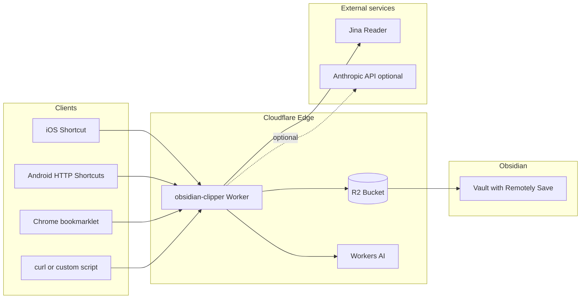

# ObsidianのRead It LaterをCloudflare WorkersとR2で自作した

> **Status: Draft** — 未公開の下書き。記事内の情報は作成時点 (2026-07) の実装状況を前提にしているため、
> 公開前に `README.md` / `HANDOFF.md` との整合を確認すること。
>
> 想定掲載先: keroway.com  
> 想定読者: Obsidianを日常的に使っていて、Read It Laterサービスのデータ所有・保存形式・連携方法に物足りなさを感じている人  
> 位置づけ: 製品紹介ではなく、自分で構築するための実装例・設計ノート

## タイトル案

1. ObsidianのRead It LaterをCloudflare WorkersとR2で自作した
2. Web記事をObsidianに直接保存する小さなパイプラインを作った
3. Readwise Readerではなく、自分のObsidian Vaultに記事を貯める仕組みを作る
4. Cloudflare Workers + R2 + Remotely Saveで作るObsidianクリッパー

## リード文案

Webで読んだ記事をあとで読み返したい、引用したい、メモと一緒に残したい。そういう用途にはReadwise Reader、Instapaper、Raindrop.ioなどの便利なサービスがあります。

ただ、自分の場合は最終的な知識置き場がObsidianなので、記事の保存先もできれば最初からObsidian Vaultの中にしたいと思っていました。さらに、保存形式はプレーンなMarkdown、同期先は自分のCloudflare R2、処理の中身も自分で把握できる状態にしたい。

そこで、Cloudflare Workers、R2、Remotely Save、Jina Reader、Workers AIを組み合わせて、WebページをObsidianのMarkdownノートとして保存する小さなRead It Laterパイプラインを作りました。

リポジトリはこちらです。

- <https://github.com/keroway/obsidian-clipper>

これはホスト済みサービスでも、誰でもすぐ使えるアプリでもありません。CloudflareやObsidianの設定を自分で行う前提の、セルフホスト向けリファレンス実装です。

## この記事で伝えたいこと

- Obsidianを保存先にしたRead It Laterの構成例
- Cloudflare Workers/R2を使うと個人用パイプラインを小さく作れること
- 「失敗してもURLとメモだけは残す」という設計方針
- サービスではなく、自分で改造するための土台として公開していること

## 書かない/薄くすること

- 全セットアップ手順の完全再掲
  - 詳細はREADMEへ誘導する
- Cloudflare WorkersやR2の一般的な入門
  - 必要最低限だけ説明する
- 「誰でも簡単に使えます」という訴求
  - 実際にはRemotely Save、R2、Wrangler、Secretsなどの理解が必要

---

# 本文構成案

## 1. なぜ作ったか

### 問題意識

- Web記事を保存しても、あとで知識ベースに統合しにくい
- Read It Laterサービスは便利だが、保存先や形式がサービス側に寄りがち
- Obsidianを使っているなら、最終成果物はMarkdownファイルとしてVaultに入っていてほしい
- iPhone/ブラウザ/スクリプトなど複数の入口から同じ形式で保存したい

### 既存サービスを使わなかった理由

否定ではなく、用途の違いとして書く。

- Readwise Reader: 体験は良いが、今回は保存先を自分のVault/R2に寄せたかった
- Instapaper/Pocket/Raindrop.io: Read It Laterとしては十分だが、Obsidian上のDataviewや自分のfrontmatter設計に直結しない
- Obsidian Web Clipper: 用途によっては便利。ただし自分のR2同期構成やCloudflare Workers側の処理を挟みたかった

まとめ:

> 既存サービスより優れたものを作りたかったわけではなく、自分の運用に合わせて「保存される場所」と「保存される形」をコントロールしたかった。

## 2. 作ったもの

`obsidian-clipper` は、URLを受け取ってMarkdownノートを生成し、Obsidian Vaultとして使っているCloudflare R2バケットへ直接書き込むCloudflare Workerです。

できること:

- `POST /clip` にURLを送る
- URLを正規化する
- Jina Readerで本文をMarkdown化する
- 必要ならWorkers AIまたはAnthropicで要約する
- タグや選択テキスト、メモをfrontmatter/本文に入れる
- R2上の `Inbox/` に `.md` ファイルとして保存する
- ObsidianはRemotely Saveであとからpullする

できない/やらないこと:

- Obsidianへリアルタイムにpushする
- Remotely Saveの暗号化済みオブジェクトへ書き込む
- ホスト済みSaaSとして提供する
- 完全なWebクリッパーUIを提供する

## 3. 全体アーキテクチャ

READMEのMermaid図を転用する。



この図で強調する点:

- WorkerはObsidianに直接触らない
- R2をVault同期の中継地点として使う
- Remotely SaveがpullするまでObsidian側には現れない
- 入口はiOS Shortcut、bookmarklet、curlなど差し替え可能

## 4. 処理フロー

1. クライアントからURLを送る
2. Bearer tokenで認証する
3. URLを正規化する
   - `utm_*`, `gclid`, X/Twitterの共有パラメータなどを削除
   - `twitter.com` / `mobile.twitter.com` を `x.com` に統一
4. Jina ReaderでMarkdown本文を取得する
5. 必要なら要約する
6. frontmatterつきMarkdownを生成する
7. R2に保存する
8. 次回のRemotely Save同期でObsidianに入る

ここではコードを全部載せず、主要な設計判断だけ説明する。

## 5. 生成されるノート

READMEの例を短縮して載せる。

```markdown
---
created: 2026-05-21T12:34:56+09:00
updated: 2026-05-21T12:34:56+09:00
source: web-clip
source_url: "https://example.com/article"
source_title: "Article title"
tags:
  - "clipped"
summary: "A short summary."
---

# Article title

<https://example.com/article>

## Summary
...

## Body
...
```

ポイント:

- `source: web-clip` を固定してDataviewで拾いやすくする
- `source_url` と `source_title` を残す
- 本文が取れなくてもURLとメモは残す
- ファイル名はJSTタイムスタンプつきにして衝突を避ける

## 6. 設計で意識したこと

### 6.1 失敗しても保存する

このツールでは、Jina Readerで本文取得に失敗しても、要約に失敗しても、基本的にはクリップ全体を失敗にしません。

理由:

- Read It Laterの最小単位はURLである
- 本文抽出や要約はあとからやり直せる
- その瞬間にユーザーが残したかったメモや選択範囲を失う方が痛い

そのため、本文取得エラーはノート本文に残し、要約エラーはログに出すだけにしています。

### 6.2 Obsidianを直接操作しない

WorkerからローカルのObsidianを直接操作することはできません。そこで、すでに使っているRemotely SaveのR2バケットにMarkdownを書き込み、Obsidian側は通常通り同期するだけにしました。

メリット:

- Obsidianプラグインを新しく作らなくてよい
- iOS/デスクトップで同じ同期経路を使える
- R2上のファイルは普通のMarkdownとして確認できる

デメリット:

- 即時反映ではない
- Remotely Saveの暗号化は使えない
- R2のprefix設定を間違えるとVault側に出てこない

### 6.3 入口を固定しない

WorkerのAPIは単純な `POST /clip` だけです。

そのため、入口は自由に変えられます。

- iOS Shortcut
- macOS Safari share sheet
- Chrome bookmarklet
- Android HTTP Shortcuts
- curl
- Raycast/Alfredなどの自作スクリプト

本体をCloudflare Workers側に寄せることで、クライアント側は「URLをPOSTするだけ」にしています。

### 6.4 個人用途に寄せる

認証は共有Bearer tokenです。チーム利用や公開サービスとしては不十分ですが、個人用のクリッパーとしてはシンプルです。

共有利用するならCloudflare Accessなどを追加した方がよい、という位置づけにしています。

## 7. Cloudflare構成

使っているもの:

- Workers: API本体
- R2: Obsidian Vaultの保存先
- Workers AI: 要約
- Secrets: `SHARED_SECRET`, `JINA_API_KEY`, `ANTHROPIC_API_KEY`など
- 任意: Browser Rendering fallback

個人用途であれば無料枠に収まりやすいことも触れる。

注意点:

- R2バケットはRemotely Saveで使っているものと同じにする
- Remotely Save暗号化はOFF
- `VAULT_PREFIX` は空文字か末尾スラッシュつき
- `SHARED_SECRET` はGitに入れない

## 8. 実際の使い方イメージ

### iPhone

1. 共有シートからShortcutを起動
2. URLと任意のメモをWorkerにPOST
3. WorkerがR2にMarkdownを保存
4. Obsidianを開いてRemotely Saveがpull
5. `Inbox/` に記事ノートが現れる

### ブラウザ

1. bookmarkletをクリック
2. 現在のページURL、タイトル、選択テキストをPOST
3. 結果をtoastで表示

### curl

```bash
curl -X POST https://obsidian-clipper.example.workers.dev/clip \
  -H "Authorization: Bearer <SHARED_SECRET>" \
  -H "Content-Type: application/json" \
  -d '{"url":"https://example.com/article","tags":["test"]}'
```

## 9. 向いている人 / 向いていない人

### 向いている人

- Obsidianを知識ベースの中心にしている
- Remotely SaveでR2同期している、または設定できる
- Cloudflare Workers/R2/Wranglerを触れる
- 自分の保存形式をコントロールしたい
- 小さな自作パイプラインをメンテナンスできる

### 向いていない人

- すぐ使える完成品がほしい
- CloudflareやCLI設定を避けたい
- Remotely Saveの暗号化を使いたい
- 高機能なWebハイライト/全文検索/リーダーUIがほしい
- チーム共有のSaaSとして使いたい

その場合はReadwise Reader、Raindrop.io、Instapaperなどを使う方がよい。

## 10. 今後やるなら

README上では多くのTODOは実装済みになっているため、記事では「ロードマップ」より「改造余地」として書く。

例:

- Logpushなどで運用ログを見やすくする
- 自分のタグ体系に合わせたauto-taggingを調整する
- 保存先フォルダをルールベースで振り分ける
- 記事本文の再取得・再要約ジョブを追加する
- Cloudflare Accessで認証を強化する

## 11. まとめ

締めの方向性:

- これは既存Read It Laterサービスの代替を目指す製品ではない
- 自分のObsidian運用に合わせて、URL→Markdown→R2→Vaultという細いパイプを作った
- Cloudflare WorkersとR2を使うと、こうした個人用ワークフローをかなり小さく実装できる
- 同じような運用をしたい人はREADMEを見て、自分のVault構成に合わせて改造してほしい

最後にリンク:

- GitHub: <https://github.com/keroway/obsidian-clipper>
- README setup section
- client examples

---

# 記事本文の短い完成イメージ

以下は冒頭から数段落だけの完成寄りサンプル。

```markdown
# ObsidianのRead It LaterをCloudflare WorkersとR2で自作した

Webで読んだ記事をあとで読み返したい、引用したい、メモと一緒に残したい。そういう用途にはReadwise Reader、Instapaper、Raindrop.ioなどの便利なサービスがあります。

ただ、自分の場合は最終的な知識置き場がObsidianなので、記事の保存先もできれば最初からObsidian Vaultの中にしたいと思っていました。保存形式はプレーンなMarkdown、同期先は自分のCloudflare R2、処理の中身も自分で把握できる状態にしたい。

そこで、Cloudflare Workers、R2、Remotely Save、Jina Reader、Workers AIを組み合わせて、WebページをObsidianのMarkdownノートとして保存する小さなRead It Laterパイプラインを作りました。

リポジトリはこちらです。

https://github.com/keroway/obsidian-clipper

なお、これはホスト済みサービスでも、誰でもすぐ使えるアプリでもありません。CloudflareやObsidianの設定を自分で行う前提の、セルフホスト向けリファレンス実装です。既存サービスより便利なものを作るというより、自分の保存場所と保存形式を自分で決めるための道具です。
```

---

# 公開時のメモ

## keroway.com側

- 本編として公開する
- READMEのアーキテクチャ図を流用する
- GitHub repo AboutのWebsite欄に記事URLを設定する
- README冒頭にも「背景記事」としてリンクを追加してよい

## Zenn側

Zennには全文転載ではなく、短縮版を出すのがおすすめ。

想定タイトル:

- Cloudflare WorkersとR2でObsidian用Read It Laterを自作した

構成:

1. なぜ作ったか
2. 全体構成
3. Workerがやること
4. ハマりどころ3つ
   - Remotely Save暗号化OFF
   - R2 prefix
   - iOSでは即時反映ではない
5. 詳細はkeroway.com/GitHubへ

Zennではセットアップ手順を細かく書きすぎず、技術構成と注意点に絞る。
