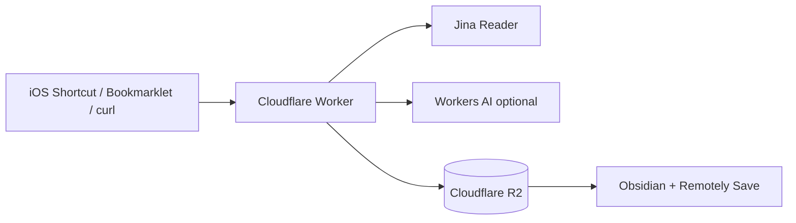

# Zenn向け短縮記事案: Cloudflare WorkersとR2でObsidian用Read It Laterを自作した

> **Status: Draft** — 未公開のアウトライン案。keroway.com 本編の公開 URL が未確定のため、
> 本文中の `keroway.comの記事URLを後で入れる` は公開前に必ず埋めること。
>
> 想定掲載先: Zenn  
> 役割: keroway.com本編への導線。技術構成・ハマりどころ・GitHubリンクを中心に短くまとめる。  
> 目安: 2,000〜3,500字

## タイトル案

- Cloudflare WorkersとR2でObsidian用Read It Laterを自作した
- ObsidianにWeb記事をMarkdown保存する小さなWorkerを作った
- Cloudflare Workers + R2 + Remotely Saveで作るObsidianクリッパー

## リード

Obsidianを知識ベースの中心にしていると、Web記事も最初からMarkdownとしてVaultに入っていてほしくなります。

そこで、URLを受け取り、本文をMarkdown化し、Cloudflare R2上のObsidian Vaultへ保存するCloudflare Workerを作りました。

- GitHub: <https://github.com/keroway/obsidian-clipper>
- 詳細な背景・設計メモ: `keroway.comの記事URLを後で入れる`

これはホスト済みサービスではなく、自分のCloudflareアカウントにデプロイして使うセルフホスト向けの実装です。

## 1. 作ったもの

`POST /clip` にURLを送ると、Workerが以下を行います。

- URLを正規化
- Jina Readerで本文をMarkdown化
- 必要ならWorkers AI/Anthropicで要約
- frontmatterつきMarkdownを生成
- Remotely Saveが使っているR2バケットに保存

Obsidian側はRemotely SaveでR2からpullします。WorkerはObsidianを直接操作しません。

## 2. 全体構成



構成要素:

| 要素 | 役割 |
| --- | --- |
| Cloudflare Workers | `POST /clip` API |
| Hono | routing/auth/CORS |
| R2 | Vault同期先のオブジェクトストレージ |
| Remotely Save | ObsidianとR2の同期 |
| Jina Reader | URLからMarkdown本文を取得 |
| Workers AI / Anthropic | 任意の要約生成 |

## 3. 生成されるノート

```markdown
---
created: 2026-05-21T12:34:56+09:00
updated: 2026-05-21T12:34:56+09:00
source: web-clip
source_url: "https://example.com/article"
source_title: "Article title"
tags:
  - "clipped"
summary: "A short summary."
---

# Article title

<https://example.com/article>

## Summary
...

## Body
...
```

`source: web-clip` を固定しているので、Dataviewなどでまとめて扱いやすくしています。

## 4. 設計上のポイント

### 本文取得や要約に失敗しても保存する

Read It Laterの最小単位はURLなので、本文抽出や要約に失敗してもクリップ全体は失敗にしません。URL、メモ、選択テキストだけでも保存します。

### 入口を固定しない

Workerは単純なHTTP APIなので、入口は自由に作れます。

- iOS Shortcut
- Chrome bookmarklet
- Android HTTP Shortcuts
- curl
- 自作スクリプト

### 個人用途に寄せる

認証はBearer tokenです。共有サービスとしては不足ですが、個人用にはシンプルです。必要ならCloudflare Accessなどを重ねる想定です。

## 5. ハマりどころ

### Remotely Saveの暗号化はOFFにする

WorkerはR2にプレーンMarkdownを書きます。Remotely Save側で暗号化を有効にしていると、Obsidian側で読めません。

### `VAULT_PREFIX` の末尾スラッシュ

R2上でVaultにprefixを使っている場合、`MyVault/` のように末尾スラッシュつきで設定する必要があります。`MyVault` だけだと `MyVaultInbox/...` のようなパスになります。

### iOSでは即時反映ではない

WorkerはR2に保存するだけです。iOSのObsidianに現れるのは、Obsidianを開いてRemotely Saveがpullしたタイミングです。

## 6. 向いている人

- Obsidianを知識ベースの中心にしている
- Remotely Save/R2を使っている、または使える
- Cloudflare WorkersやWranglerを触れる
- 自分の保存形式をコントロールしたい

逆に、すぐ使える完成品が欲しい場合はReadwise Reader、Raindrop.io、Instapaperなどを使う方がよいです。

## 7. まとめ

Cloudflare WorkersとR2を使うと、個人用の小さな情報保存パイプラインをかなりシンプルに作れます。

この実装は汎用サービスではなく、自分のObsidian運用に合わせて改造するための土台です。同じような構成に興味があれば、READMEを見ながら自分のVault構成に合わせて試してみてください。

- GitHub: <https://github.com/keroway/obsidian-clipper>
- 詳細記事: `keroway.comの記事URLを後で入れる`

## 公開時のタグ案

- CloudflareWorkers
- Obsidian
- TypeScript
- Hono
- R2
